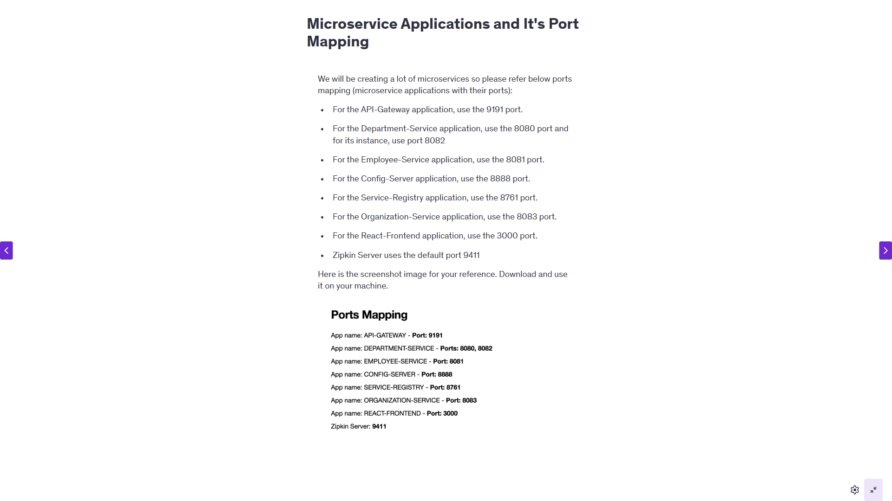

# <u>Design Patterns</u>
* DTO - Data Transfer Object
  *     *--> Model Mapper Library
        -->  Map Struct Library
***
> Spring cloud provides solution for the below patterns
> by Providing respective modules.
* API Gateway Pattern
* Config Server Pattern
* Circuit Breaker Pattern
* Service Registry & Discovery Pattern
* Distributed Tracing Pattern
***

# Spring Cloud
```html
1. Service Registry & Discovery --> Spring Cloud Netflix Eureka Server
2. Config Server --> Spring Cloud Config Server
  * --> Spring Cloud bus -> provides a solution for refreshing all the 
        subscribed microservices automatically.
3. API Gateway --> Spring Cloud Gateway (Internally uses netty server not the tomcat server)
4. Distributed Tracing --> Spring Cloud Sleuth
    * --> Along with <b>'Spring Cloud Sleuth'</b> we will use <b>'Zipkin'</b> to visualize the tracing log
       information in GUI
5. Circuit Breaker --> Spring Cloud Circuit Breaker
  * --> Using Resilience 4J framework
  * --> Retry Pattern using Resilience 4J framework
```
 
***
## Different ways to communicate from 1 microservice to another
```html
1. Synchronous
   * --> Rest Template
   * --> Web Client
   * --> Spring Cloud Open Feign
2. Asynchronous (Using Message Broker (Queue))
   * --> RabbitMQ
   * --> Apache Kafka
```

````html
Reference Links Used in this Section of the Lectures
Here are the links for your reference:

https://spring.io/projects/spring-cloud-circuitbreaker

https://resilience4j.readme.io/

https://resilience4j.readme.io/docs/circuitbreaker

https://resilience4j.readme.io/docs/retry
````



***
***

# <u>Annotations</u>

## Configuration
```properties
spring.application.name=spring-boot-rest-api

spring.datasource.url=jdbc:mysql://localhost:3306/ecommerce?useSSL=false
spring.datasource.username=root
spring.datasource.password=root

spring.jpa.hibernate.ddl-auto=update
#spring.jpa.properties.hibernate.show_sql= true
#spring.jpa.properties.hibernate.format_sql=true

management.endopints.web.exposure.include=*
```

## Lombok

```java
@Getter
@Setter
@NoArgsConstructor
@AllArgsConstructor
```

## JPA

```java
@Getter
@Setter
@NoArgsConstructor
@AllArgsConstructor
@Entity
@Table(name="users")
public class User {

    @Id
    @GeneratedValue(strategy = GenerationType.IDENTITY)
    private Long id;
    @Column(nullable=false)
    private String firstName;
    @Column(nullable=false)
    private String lastName;
    @Column(nullable = false, unique = true)
    private String email;
}
```

```java
@RestController
@Service

@RequestMapping

@PostMapping
@GetMapping
@PutMapping
@DeleteMapping

@PathVariable
@RequestParam
@RequestBody

@Bean

> @ExceptionHandler(provide class name here)
        --> Handle Controller level specific exception
> @ControllerAdvice
        --> Hanlde Exceptions Globally both specific and Others
```
>No need to provide @Repository annotation as SimpleJpaRepository class
> is already having @Repository & @Transactional annotations

```java
public interface UserRepository extends JpaRepository<User, Long>{
}
```

