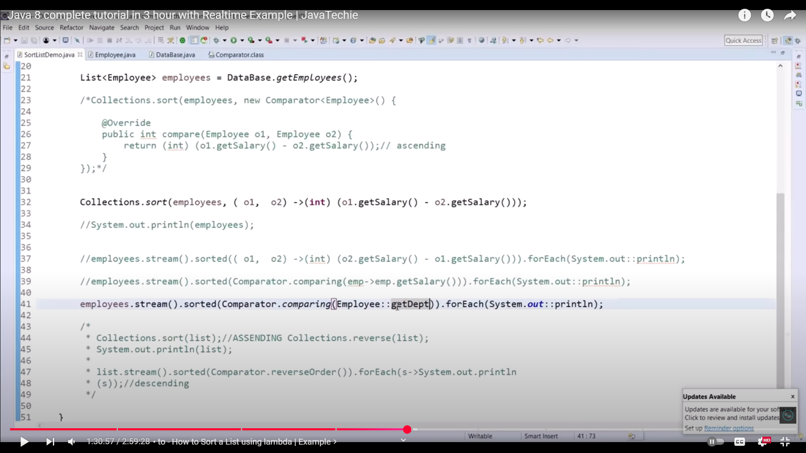
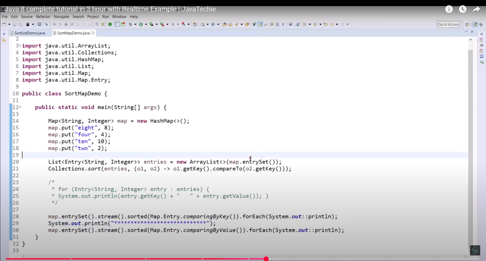
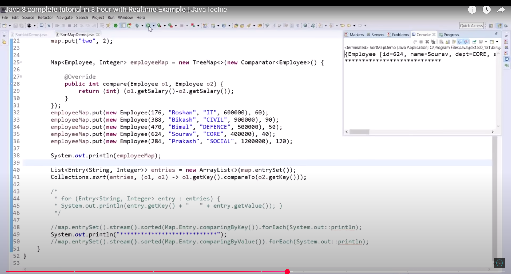
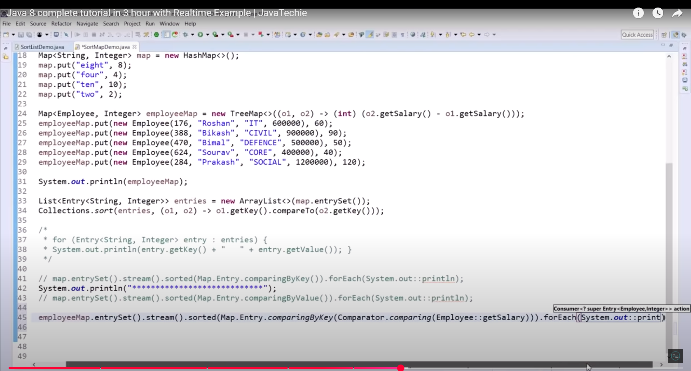
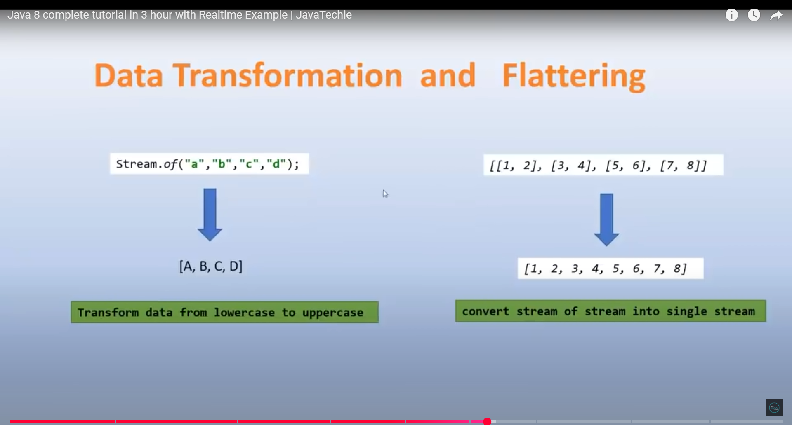

## Lambda Expressions --> () -> {}
  * --> Works only with functional interfaces

## Functional Interfaces -->
  * --> For ex: Runnable / Callable / Comparable / Comparator 
  * --> Interfaces those who have 1 abstract method and multiple default / static methods

##  Pre-Defined functional interfaces in Java 8 
 1. Consumer  --> void accept(T t)  --> forEach(Consumer<T> consumer)
 2. Predicate --> boolean test(T t) --> filter(Predicate<T> perdicate)
 3. Supplier  --> T get()           --> orElseGet(Supplier<T> supplier)

***

## Stream API --> forEach & filter method example
1. filter --> for conditional check
2. forEach --> for iteration

## Sort a list using lambda stream api
 * --> Traditional Way --> Collections.sort(object, lambda-comaprator) 
1. Ascending --> sorted() --> sorted(lambda-expression)
2. Descending --> sorted(Comparator.reverseOrder())

## Method Reference

## Sort a Map using lambda stream api

***

## Map() & flatMap()
